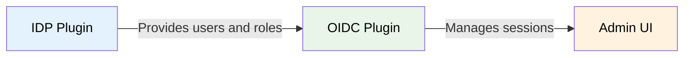
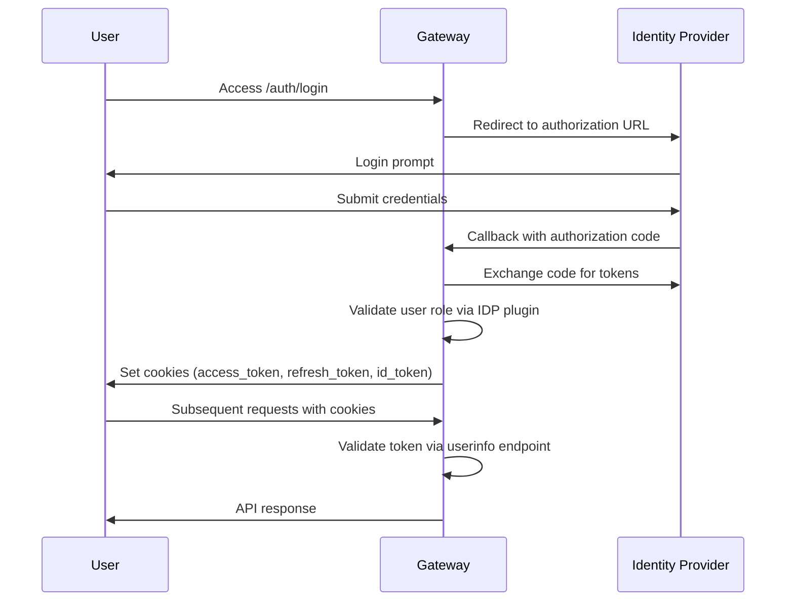

# OIDC Plugin

:::info[Enterprise Feature]{className="enterprise-badge"}
This feature is available exclusively in the **Enterprise edition** of the Radicalbit AI Gateway. [Contact sales](mailto:sales@radicalbit.ai) for licensing information.
:::

The OIDC plugin provides OpenID Connect-based Single Sign-On for all admin and registry APIs in the gateway. It is a standardized plugin that works with any compatible IDP plugin — currently the [Keycloak IDP Plugin](./keycloak-idp.md) is the supported implementation.

---

## How It Fits

The access control system is composed of two independent plugins:

- **IDP Plugin** (e.g. Keycloak) — handles user/group sync, RBAC, and token validation. This is the pluggable part: different identity providers can be supported.
- **OIDC Plugin** — handles SSO session management for the admin interface via the standard OpenID Connect protocol. This stays the same regardless of which IDP plugin is used.



:::tip
If you need integration with an identity provider other than Keycloak, [contact sales](mailto:sales@radicalbit.ai) to discuss a custom IDP plugin. The OIDC plugin will work with any IDP plugin out of the box.
:::

---

## Prerequisites

- A compatible **IDP plugin** must be enabled and configured first (currently `keycloak_idp`)
- An OIDC client configured in your identity provider

---

## Enabling the Plugin

```bash
export ENABLED_PLUGINS="registry_oidc_auth"
```

The plugin is typically enabled alongside an IDP plugin:

```bash
export ENABLED_PLUGINS="keycloak_idp,registry_oidc_auth"
```

---

## Environment Variables

| Variable | Required | Default | Description |
|---|---|---|---|
| `OIDC_CLIENT_ID` | Yes | — | Client ID of the OIDC client configured in your identity provider |
| `OIDC_SECRET_KEY` | Yes | — | Client secret from your identity provider |
| `OIDC_SERVER_METADATA_URL` | Yes | — | OIDC discovery metadata URL (e.g. `http://keycloak:8080/realms/gateway/.well-known/openid-configuration`) |
| `SESSION_SECRET_KEY` | No | `session-secret-key` | Key used to encrypt session cookies |

---

## Authentication Flow

The plugin implements a standard OIDC Authorization Code flow:



### Login

Users are redirected to the identity provider's login page. After successful authentication, the gateway:

1. Exchanges the authorization code for tokens
2. Verifies the user exists in the local user table with an assigned role
3. Sets HttpOnly, secure cookies:
   - `access_token` — 1 day expiration
   - `refresh_token` — 30 day expiration
   - `id_token` — 1 day expiration

### Token Validation

For every request to admin endpoints, the middleware:

1. Extracts the `access_token` cookie
2. Calls the OIDC userinfo endpoint to validate the token
3. Verifies the user exists in the local user table with a role
4. If the access token is expired, attempts to refresh it using the `refresh_token`
5. If refresh fails, clears cookies and returns `401 Unauthorized`

### Logout

Users can initiate logout via `/auth/logout`. The gateway:

1. Terminates the SSO session by redirecting to the identity provider's end session endpoint
2. Clears all authentication cookies

---

## Docker Compose Example

```yaml
services:
  keycloak:
    image: quay.io/keycloak/keycloak:26.0
    command: start-dev
    environment:
      KEYCLOAK_ADMIN: admin
      KEYCLOAK_ADMIN_PASSWORD: admin
    ports:
      - "8080:8080"

  gateway:
    image: radicalbit/ai-gateway:latest
    environment:
      ENABLED_PLUGINS: "keycloak_idp,registry_oidc_auth"
      KEYCLOAK_IDP_SERVER_URL: "http://keycloak:8080"
      KEYCLOAK_IDP_ADMIN_USER: "admin"
      KEYCLOAK_IDP_ADMIN_PASSWORD: "admin"
      KEYCLOAK_IDP_ADMIN_REALM: "master"
      KEYCLOAK_IDP_APP_REALM: "gateway"
      KEYCLOAK_IDP_IMPORT_GROUPS: "api-users"
      KEYCLOAK_IDP_RBAC_GROUPS: "gateway-users"
      KEYCLOAK_IDP_RBAC_ADMIN_GROUPS: "gateway-admins"
      OIDC_CLIENT_ID: "gateway-client"
      OIDC_SECRET_KEY: "your-client-secret"
      OIDC_SERVER_METADATA_URL: "http://keycloak:8080/realms/gateway/.well-known/openid-configuration"
      SESSION_SECRET_KEY: "a-strong-random-secret"
    ports:
      - "9000:9000"
    depends_on:
      - keycloak
```

---

## Dependencies

- `authlib==1.3.1` — installed automatically from `requirements.txt` when the plugin is enabled
- `itsdangerous>=2.1.0` — installed automatically from `requirements.txt` when the plugin is enabled
- `python-dotenv==1.0.1` — installed automatically from `requirements.txt` when the plugin is enabled

---

## Next Steps

- **[Keycloak IDP Plugin](./keycloak-idp.md)** — Configure Keycloak integration and user sync
- **[Access Control Overview](./index.md)** — Review the roles and architecture
