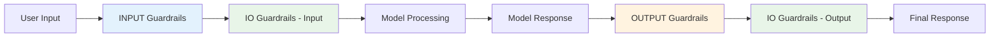
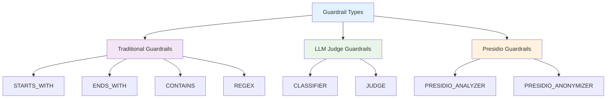
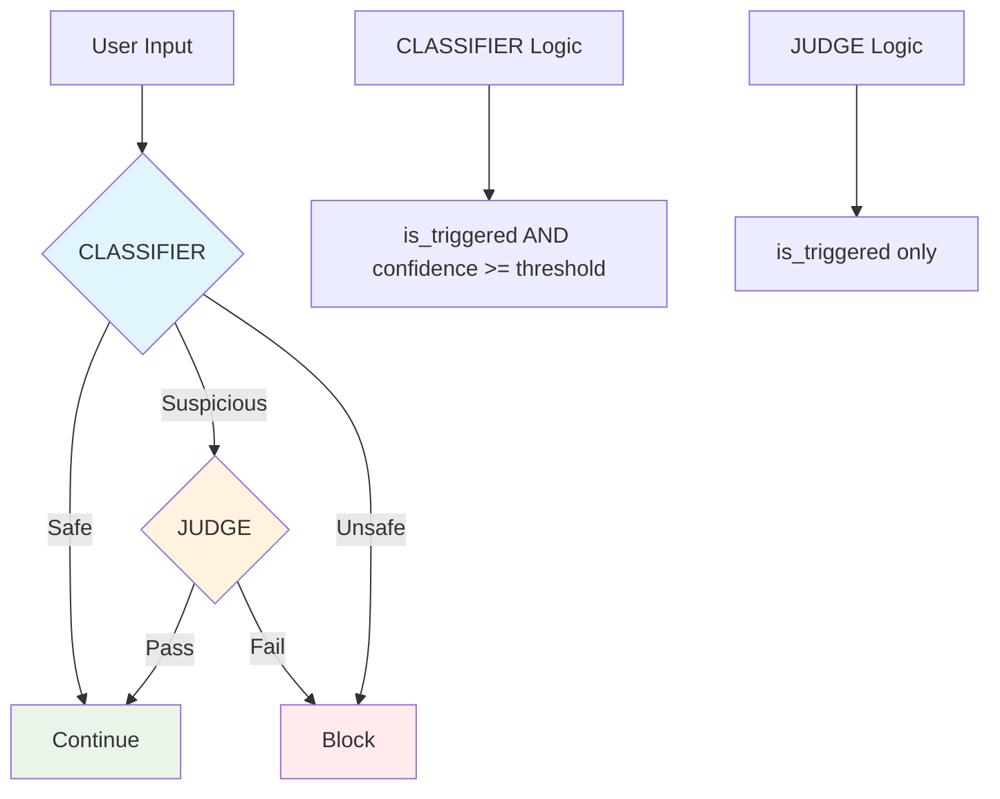
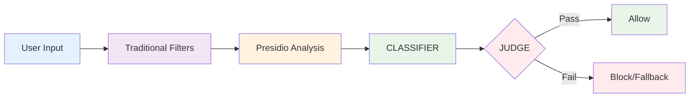
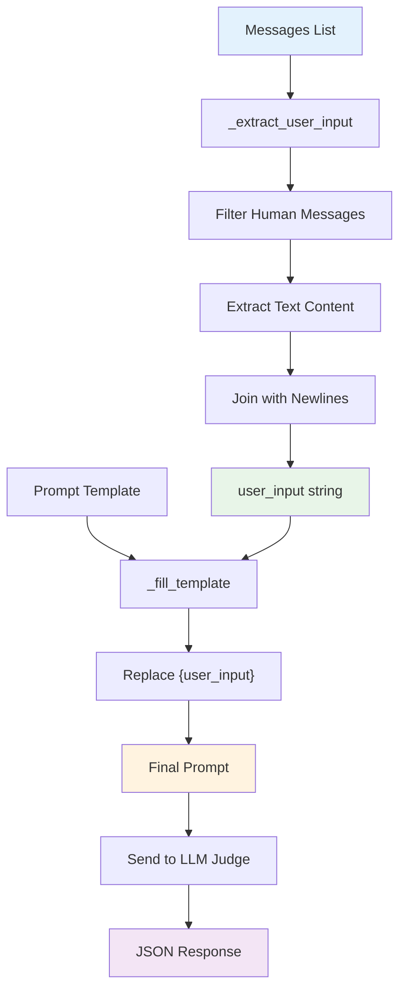

# Guardrails

Guardrails are content safety and filtering mechanisms that help ensure your AI applications behave appropriately and securely.

## What are Guardrails?

Guardrails act as a security layer between user input and AI models, providing:

- **Content Filtering**: Block or modify inappropriate content
- **Security Protection**: Prevent prompt injection and misuse
- **Compliance**: Ensure adherence to data protection regulations
- **Custom Rules**: Implement business-specific content policies

## Execution Flow

Guardrails are executed in a specific order to ensure comprehensive content safety:

1. **Input Phase**: `input` and `io` guardrails check user messages
2. **Model Invocation**: AI model processes the request
3. **Output Phase**: `output` and `io` guardrails check model response



## Types of Guardrails

### Guardrail Types Architecture



### Traditional Guardrails
Fast, rule-based content filtering using pattern matching:

- **Starts With**: Check if text starts with specific strings
- **Ends With**: Check if text ends with specific strings  
- **Contains**: Check if text contains specific keywords
- **Regex**: Use regular expressions for complex patterns

### LLM Judge Guardrails
AI-powered intelligent content evaluation:

- **Classifier**: Lightweight classification with confidence thresholds
- **Judge**: In-depth evaluation for critical security decisions

#### CLASSIFIER vs JUDGE Decision Flow



### Presidio Guardrails
Privacy and PII protection:

- **Analyzer**: Detect personally identifiable information
- **Anonymizer**: Replace PII with placeholders

## Optimal Guardrail Processing Flow

For maximum security and efficiency, guardrails should be processed in this order:

1. **Traditional Filters** → Fast pattern matching
2. **Presidio Analysis** → PII detection and anonymization
3. **CLASSIFIER Guardrails** → Lightweight AI classification
4. **JUDGE Guardrails** → Final security decisions



## Configuration Examples

### Basic Content Filtering

```yaml
guardrails:
  - name: profanity_filter
    type: contains
    where: input
    behavior: block
    parameters:
      values: ["inappropriate", "offensive"]
    response_message: "Content blocked due to inappropriate language"
```

### Business Context Validation

```yaml
guardrails:
  - name: business_context_judge
    type: judge
    where: input
    behavior: block
    parameters:
      judge_config:
        prompt_ref: "business_context_check.md"
        model_id: "gpt-3.5-turbo"
        temperature: 0.7
        max_tokens: 150
        threshold: 0.001
    response_message: "Request not aligned with business context"
```

### PII Protection

```yaml
guardrails:
  - name: pii_anonymizer
    type: presidio_anonymizer
    where: io
    behavior: warn
    parameters:
      language: en
      entities: ["EMAIL_ADDRESS", "PHONE_NUMBER"]
```

## User Input Processing Flow

LLM Judge guardrails process user input through a specific extraction and template filling process:



## Guardrail Behaviors

- **Block**: Completely block the request
- **Soft Block**: Block with custom message
- **Warn**: Log warning but allow request
- **Fallback**: Switch to safer model
- **Degrade**: Temporarily reduce model capabilities

## Best Practices

1. **Layer Defense**: Use multiple guardrail types together
2. **Test Thoroughly**: Validate guardrails with various inputs
3. **Monitor Performance**: Track guardrail effectiveness
4. **Regular Updates**: Keep guardrail rules current
5. **User Experience**: Provide clear feedback for blocked content

## Advanced Features

### Fallback Mechanisms
When guardrails detect suspicious content, automatically switch to safer models:

```yaml
guardrails:
  - name: toxicity_judge_fallback
    type: judge
    behavior: fallback
    parameters:
      judge_config:
        model_id: "gpt-4o-mini"
        fallback_model_id: "gpt-3.5-turbo"
        fallback_duration_seconds: 60
```

### Time-based Degradation
Temporarily reduce model capabilities for suspicious content:

```yaml
guardrails:
  - name: suspicious_content_degrade
    type: judge
    behavior: degrade
    parameters:
      judge_config:
        action_on_fail: "degrade"
        degrade_params:
          temperature: 0.1
          max_tokens: 100
          duration_seconds: 300
```

## Monitoring and Analytics

Track guardrail performance through:

- **Metrics Dashboard**: Real-time guardrail statistics
- **Log Analysis**: Detailed logs of guardrail decisions
- **Alert System**: Notifications for unusual patterns
- **Reporting**: Regular reports on content safety

## Next Steps

- **[Load Balancing](../configuration/load-balancing.md)** - Distribute requests across models
- **[Fallback Mechanisms](../configuration/fallback.md)** - Implement automatic failover
- **[API Reference](../api-reference/endpoints.md)** - Complete API documentation
