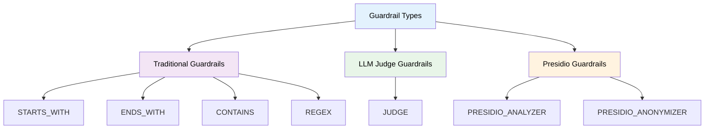
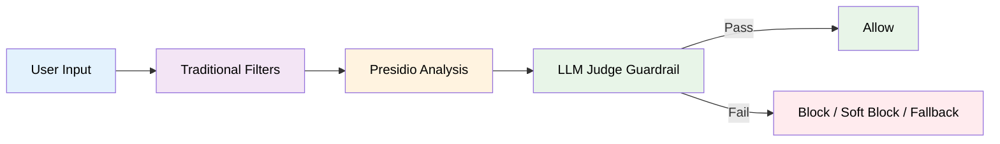

```mermaid
graph LR
    A[User Input] --> B[INPUT Guardrails]
    B --> C[IO Guardrails - Input]
    C --> D[Model Processing]
    D --> E[Model Response]
    E --> F[OUTPUT Guardrails]
    F --> G[IO Guardrails - Output]
    G --> H[Final Response]

    style B color:#000, fill:#e3f2fd
    style C color:#000, fill:#e8f5e8
    style F color:#000, fill:#fff3e0
    style G color:#000, fill:#e8f5e8
```

# Guardrails

Guardrails are content safety and filtering mechanisms that help ensure your AI applications behave appropriately and securely.

## What are Guardrails?

Guardrails act as a security layer between user input and AI models, providing:

- **Content Filtering**: Block or modify inappropriate content
- **Security Protection**: Prevent prompt injection and misuse
- **Privacy Protection**: Detect and mask PII using Presidio guardrails
- **Custom Rules**: Implement business-specific content policies

## Execution Flow

Guardrails are executed in a specific order to ensure comprehensive content safety:

1. **Input Phase**: `input` and `io` guardrails check user messages
2. **Model Invocation**: AI model processes the request
3. **Output Phase**: `output` and `io` guardrails check model response



## Types of Guardrails

### Guardrail Architecture

The Radicalbit AI Gateway supports multiple guardrail families:



### Traditional Guardrails
Fast, rule-based content filtering using pattern matching:

- **Starts With**: Check if text starts with specific strings
- **Ends With**: Check if text ends with specific strings  
- **Contains**: Check if text contains specific keywords
- **Regex**: Use regular expressions for complex patterns

### LLM Judge Guardrails
LLM-based semantic evaluators, executed by the `JudgeEngine`.  
They use a **language model as a “judge”** to reason over user inputs or model outputs and determine whether they violate safety or policy rules.

### How It Works

1. The user input (or output) is extracted and normalized.  
2. The text is inserted into a **prompt template** (`prompt_ref`).  
3. The LLM defined in `model_id` is invoked via LangChain’s `init_chat_model()`.  
4. The LLM response is parsed into a `JudgeResult` Pydantic object.  
5. The decision (`is_triggered`, optional `reasoning`) determines the guardrail behavior.  
6. Optionally, a **fallback model** (`fallback_model_id`) is invoked if the primary fails.

---

### Engine Internals

The `JudgeEngine` is responsible for executing guardrails that rely on large language models.  
It integrates with `LangChain` and the Radicalbit model abstraction layer (`Model`) and supports dynamic model configuration.

| Component | Description |
|------------|-------------|
| **JudgePromptManager** | Loads built-in and user-defined prompt templates |
| **PromptTemplate** | Defines structured LLM prompts with formatting and output schema |
| **PydanticOutputParser** | Parses the model output into a `JudgeResult` object |
| **Model Cache** | Optimizes repeated model usage by caching initialized instances |
| **Fallback Logic** | Automatically retries with a fallback model if the primary fails |

---

### Built-in Prompt Templates

The following templates are included by default:

| Prompt | Purpose |
|--------|----------|
| **toxicity_check.md** | Detects offensive, abusive, or harmful content |
| **business_context_check.md** | Validates if the request aligns with your business domain |
| **prompt_injection_check.md** | Identifies potential prompt injection or jailbreak attempts |

Users can also add **custom prompts** by creating Markdown files and referencing them via `prompt_ref`.

### Custom Prompts Configuration

Custom prompts can be configured using the `JUDGE_PROMPTS_DIR` environment variable:

1. **Create custom prompt files**: Create Markdown files with your prompt templates
2. **Mount the directory**: Mount your custom prompts directory in Docker
3. **Set environment variable**: Set `JUDGE_PROMPTS_DIR` to the path inside the container

**Example Docker Compose configuration:**
```yaml
services:
  gateway:
    environment:
      - JUDGE_PROMPTS_DIR=/radicalbit_ai_gateway/radicalbit_ai_gateway/guardrails/judges/custom-prompts
    volumes:
      - ./custom-prompts:/radicalbit_ai_gateway/radicalbit_ai_gateway/guardrails/judges/custom-prompts
```

**Prompt file structure:**
- Default prompts: `/radicalbit_ai_gateway/radicalbit_ai_gateway/guardrails/judges/prompts` (bundled in image)
- Custom prompts: Path specified by `JUDGE_PROMPTS_DIR`
- Search order: Custom prompts are checked first; if not found, defaults are used

**Custom prompt template example** (`custom_ethical_check.md`):
```markdown
You are a compliance officer ensuring that all AI responses adhere to ethical standards.
Evaluate the following user input and decide if it violates company ethical policies.
```

---

### Configuration Example

#### Toxicity Detection

```yaml
guardrails:
  - name: toxicity_judge
    type: judge
    description: In-depth toxic content evaluation using LLM judge
    where: input
    behavior: soft_block
    response_message: "🚨 BLOCKED - Toxic content detected."
    parameters:
      prompt_ref: "toxicity_check.md"
      model_id: "gpt-4o-mini"
      temperature: 0.7
      max_tokens: 100
      fallback_model_id: "gpt-3.5-turbo"
```

#### Custom Ethical Policy Check

```yaml
guardrails:
  - name: ethical_guardrail
    type: judge
    where: io
    behavior: block
    parameters:
      prompt_ref: "custom_ethical_check.md"
      model_id: "gpt-4o-mini"
      temperature: 0.3
      max_tokens: 150
```

**Example of `custom_ethical_check.md`:**

```md
You are a compliance officer ensuring that all AI responses adhere to ethical standards.
Evaluate the following user input and decide if it violates company ethical policies.

Return JSON:
{
  "is_triggered": boolean,
  "reasoning": string | null
}
```

---


## Presidio Guardrails

Guardrails for **PII detection and anonymization**, powered by Microsoft Presidio.

- **Analyzer:** Detects sensitive entities (e.g. email, phone number, SSN)  
- **Anonymizer:** Masks detected entities with placeholders  

```yaml
guardrails:
  - name: pii_anonymizer
    type: presidio_anonymizer
    where: io
    behavior: warn
    parameters:
      language: en
      entities: ["EMAIL_ADDRESS", "PHONE_NUMBER"]
```

---

## Recommended Guardrail Order

1. **Traditional Filters** → Fast rule-based screening  
2. **Presidio Analysis** → PII detection and masking  
3. **Judge Guardrails** → Deep semantic safety validation  



---

## Guardrail Behaviors

| Behavior | Action | Description |
|-----------|---------|-------------|
| **block** | ❌ | Fully reject the request |
| **soft_block** | ⚠️ | Reject but show a user-friendly message |
| **warn** | 🟡 | Log a warning but allow continuation |
| **fallback** | 🔄 | Retry using a safer or fallback model |

---

## Best Practices

1. **Combine Layers:** Stack fast filters with semantic checks  
2. **Use Fallbacks:** Provide fallback models for robustness  
3. **Keep Prompts Modular:** Reuse and version prompt templates  
4. **Explain Decisions:** Enable `include_reasoning` for auditability  
5. **Monitor and Tune:** Track latency and guardrail trigger frequency  

---

## Monitoring and Analytics

Track guardrail performance through:

- **Metrics Dashboard**: Real-time guardrail statistics
- **Log Analysis**: Detailed logs of guardrail decisions
- **Alert System**: Notifications for unusual patterns
- **Reporting**: Regular reports on content safety

## Next Steps

- **[Fallback Mechanisms](../configuration/fallback.md)** - Implement automatic failover
- **[API Reference](../api-reference/endpoints.md)** - Complete API documentation
