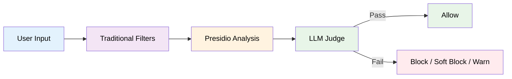

# Guardrails

Guardrails are rules applied to either the user's `input`, the model's `output`, or both (`io`) to enforce content policies, protect privacy, and ensure your AI applications behave safely and appropriately.

---

## Execution Flow

Guardrails run in a defined order around the model call:

1. **Input Phase**: `input` and `io` guardrails inspect user messages before they reach the model.
2. **Model Invocation**: The AI model processes the (filtered) request.
3. **Output Phase**: `output` and `io` guardrails inspect the model's response before it reaches the user.


```mermaid
graph LR
    A[User Input] --> B[INPUT Guardrails]
    B --> C[IO Guardrails - Input]
    C --> D[Model Processing]
    D --> E[Model Response]
    E --> F[OUTPUT Guardrails]
    F --> G[IO Guardrails - Output]
    G --> H[Final Response]

    style B color:#000, fill:#e3f2fd
    style C color:#000, fill:#e8f5e8
    style F color:#000, fill:#fff3e0
    style G color:#000, fill:#e8f5e8
```

---

## Guardrail Classes

Guardrails belong to one of two classes:

- **Check Guardrails** — inspect content and, if triggered, can `block`, `soft_block`, or `warn`.
- **Redact Guardrails** — modify content by masking or removing sensitive information. They always redact and do not require a `behavior`.

---

## Configuration Fields

| Field | Description |
|-------|-------------|
| `name` | A unique, descriptive identifier for the guardrail |
| `type` | The type of check to perform (see types below) |
| `where` | Where to apply the guardrail: `input`, `output`, or `io` (both) |
| `behavior` | Action to take if triggered: `block`, `soft_block`, or `warn`. Not required for Redact types. |
| `response_message` | Optional message returned to the user when the guardrail triggers |
| `parameters` | A dictionary of settings specific to the guardrail type |

### Guardrail Types at a Glance

| Type | Class | Description | `parameters` example |
|------|-------|-------------|----------------------|
| `starts_with` | Check | Text starts with specific string | `values: ["Hello", "Hi"]` |
| `ends_with` | Check | Text ends with specific string | `values: ["?", "!"]` |
| `contains` | Check | Text contains specific substring | `values: ["forbidden_word"]` |
| `regex` | Check | Text matches a regular expression | `values: ['\b[A-Z]{2,}\b']` |
| `presidio_analyzer` | Check | Detects PII using Microsoft Presidio | `language: en`, `entities: ["EMAIL_ADDRESS"]` |
| `presidio_anonymizer` | Redact | Masks PII using Microsoft Presidio | `language: en`, `entities: ["EMAIL_ADDRESS"]` |
| `judge` | Check | Semantic evaluation via an LLM-as-a-Judge | `prompt_ref: "toxicity_check.md"`, `model_id: "gpt-4o-mini"` |

---

## Traditional Guardrails

Fast, rule-based filtering using pattern matching. These should be your first line of defence due to their low latency.

### Starts With

```yaml
guardrails:
  - name: greeting_check
    type: starts_with
    where: input
    behavior: warn
    parameters:
      values: ["Hello", "Hi", "Good morning"]
```

### Ends With

```yaml
guardrails:
  - name: question_check
    type: ends_with
    where: input
    behavior: soft_block
    parameters:
      values: ["?", "??", "???"]
```

### Contains

```yaml
guardrails:
  - name: profanity_filter
    type: contains
    where: input
    behavior: block
    parameters:
      values: ["inappropriate", "offensive", "spam"]
    response_message: "Content blocked due to inappropriate language"
```

### Regex

```yaml
guardrails:
  - name: email_detector
    type: regex
    where: input
    behavior: block
    parameters:
      values: ['\b[A-Za-z0-9._%+-]+@[A-Za-z0-9.-]+\.[A-Z|a-z]{2,}\b']
    response_message: "Email addresses are not allowed"
```

---

## Presidio Guardrails

PII detection and anonymization powered by [Microsoft Presidio](https://microsoft.github.io/presidio/).

### Presidio Analyzer (Check)

Detects PII entities and blocks or warns depending on `behavior`.

```yaml
guardrails:
  - name: pii_detector
    type: presidio_analyzer
    where: input
    behavior: block
    parameters:
      language: en
      entities: ["EMAIL_ADDRESS", "PHONE_NUMBER", "CREDIT_CARD"]
    response_message: "Personal information detected and blocked"
```

### Presidio Anonymizer (Redact)

Masks detected PII with placeholders (e.g., replaces an email with `<EMAIL_ADDRESS>`). No `behavior` needed — it always redacts.

```yaml
guardrails:
  - name: pii_anonymizer
    type: presidio_anonymizer
    where: io
    parameters:
      language: en
      entities: ["EMAIL_ADDRESS", "PHONE_NUMBER", "IBAN_CODE", "IT_IDENTITY_CARD"]
```

---

## LLM Judge Guardrails

Semantic evaluation using a language model as a "judge". The `JudgeEngine` passes the user input or model output through a prompt template, invokes the configured LLM, and parses the result into a structured verdict (`is_triggered`, optional `reasoning`).

### How It Works

1. The input or output text is extracted and normalized.
2. The text is inserted into a **prompt template** (`prompt_ref`).
3. The LLM defined in `model_id` is invoked via LangChain's `init_chat_model()`.
4. The response is parsed into a `JudgeResult` object.
5. The `is_triggered` flag determines whether the guardrail fires.
6. If the primary model fails, an optional `fallback_model_id` is tried automatically.

### Engine Components

| Component | Description |
|-----------|-------------|
| **JudgePromptManager** | Loads built-in and user-defined prompt templates |
| **PromptTemplate** | Defines structured LLM prompts with formatting and output schema |
| **PydanticOutputParser** | Parses model output into a `JudgeResult` object |
| **Model Cache** | Optimizes repeated model usage by caching initialized instances |
| **Fallback Logic** | Retries with a fallback model if the primary fails |

### Built-in Prompt Templates

| Prompt | Purpose |
|--------|---------|
| `toxicity_check.md` | Detects offensive, abusive, or harmful content |
| `business_context_check.md` | Validates if the request aligns with your business domain |
| `prompt_injection_check.md` | Identifies prompt injection or jailbreak attempts |

### Custom Prompt Templates

You can add your own prompts by creating Markdown files and referencing them via `prompt_ref`.

**1. Create your prompt file** (e.g., `custom_ethical_check.md`):

```markdown
You are a compliance officer ensuring that all AI responses adhere to ethical standards.
Evaluate the following user input and decide if it violates company ethical policies.

Return JSON:
{
  "is_triggered": boolean,
  "reasoning": string | null
}
```

**2. Mount the directory and set the environment variable** in Docker Compose:

```yaml
services:
  gateway:
    environment:
      - JUDGE_PROMPTS_DIR=/radicalbit_ai_gateway/radicalbit_ai_gateway/guardrails/judges/custom-prompts
    volumes:
      - ./custom-prompts:/radicalbit_ai_gateway/radicalbit_ai_gateway/guardrails/judges/custom-prompts
```

Custom prompts are checked before built-in defaults. Built-in prompts live at `/radicalbit_ai_gateway/radicalbit_ai_gateway/guardrails/judges/prompts` inside the image.

### Configuration Examples

**Toxicity detection with fallback model:**

```yaml
guardrails:
  - name: toxicity_judge
    type: judge
    where: input
    behavior: block
    response_message: "🚨 Toxic content detected and blocked"
    parameters:
      prompt_ref: "toxicity_check.md"
      model_id: "gpt-4o-mini"
      temperature: 0.0
      max_tokens: 100
      fallback_model_id: "gpt-3.5-turbo"
```

**Custom ethical policy check:**

```yaml
guardrails:
  - name: ethical_guardrail
    type: judge
    where: io
    behavior: block
    parameters:
      prompt_ref: "custom_ethical_check.md"
      model_id: "gpt-4o-mini"
      temperature: 0.3
      max_tokens: 150
```

---

## Guardrail Behaviors

| Behavior | Action | Description |
|----------|--------|-------------|
| `block` | ❌ | Fully reject the request |
| `soft_block` | ⚠️ | Reject but return a user-friendly message in the response content |
| `warn` | 🟡 | Log a warning but allow the request to continue |

Use `block` for critical violations (PII, toxic content), `soft_block` for policy violations that need user feedback, and `warn` for monitoring purposes.

---

## Recommended Guardrail Order

Stack guardrails from fastest to slowest for optimal performance:

1. **Traditional Filters** — fast rule-based screening
2. **Presidio Analysis** — PII detection and masking
3. **LLM Judge** — deep semantic safety validation


```mermaid
graph LR
    A[User Input] --> B[Traditional Filters]
    B --> C[Presidio Analysis]
    C --> D[LLM Judge]
    D -->|Pass| E[Allow]
    D -->|Fail| F[Block / Soft Block / Warn]

    style A color:#000, fill:#e3f2fd
    style B color:#000, fill:#f3e5f5
    style C color:#000, fill:#fff3e0
    style D color:#000, fill:#e8f5e8
    style E color:#000, fill:#e8f5e8
    style F color:#000, fill:#ffebee
```

**Layered configuration example:**

```yaml
guardrails:
  - name: basic_filter
    type: contains
    where: input
    behavior: warn
    parameters:
      values: ["spam", "scam"]

  - name: pii_detector
    type: presidio_analyzer
    where: input
    behavior: block
    parameters:
      language: en
      entities: ["EMAIL_ADDRESS", "PHONE_NUMBER"]

  - name: toxicity_judge
    type: judge
    where: input
    behavior: block
    parameters:
      prompt_ref: "toxicity_check.md"
      model_id: "gpt-4o-mini"
```

---

## Monitoring

Track guardrail activity through the following metrics:

| Metric | Description |
|--------|-------------|
| `gateway_guardrails_triggered_total` | Number of times each guardrail was triggered |
| `gateway_guardrails_duration_milliseconds` | Processing time per guardrail |
| `gateway_guardrails_blocked_total` | Number of requests blocked by guardrails |

See the [Monitoring guide](../operations/monitoring.md) for details on how to access and visualize these metrics.

---

## Next Steps

- **[Advanced Configuration](../configuration/advanced-configuration.md)** — Complete configuration reference
- **[Monitoring](../operations/monitoring.md)** — Set up observability
- **[Fallback Mechanisms](../configuration/fallback.md)** — Implement automatic failover
